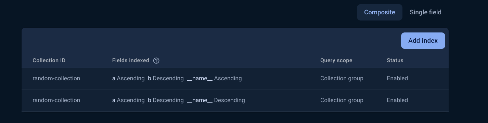
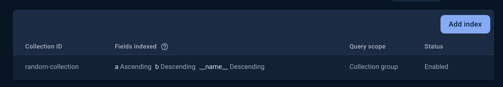

# Repro for issue 7629

## Versions

firebase-tools: v13.16.0

## Steps to reproduce issue

1. Add Firebase config to `public/index.html` in `// TODO: Add your firebase config here`
2. Run `firebase emulators:start --project PROJECT_ID`
3. Open http://127.0.0.1:5000
4. Generate the query index
   1. Click `get doc: __name__ asc` button
   2. Open console logs, and open the link to create the query index
   3. Click `get doc: __name__ desc` button
   4. Open console logs, and open the link to create the query index
   5. Wait for index to finish building
5. Run `firebase firestore:indexes --project PROJECT_ID`
   - Outputs

```
{
  "indexes": [
    {
      "collectionGroup": "random-collection",
      "queryScope": "COLLECTION_GROUP",
      "fields": [
        {
          "fieldPath": "a",
          "order": "ASCENDING"
        },
        {
          "fieldPath": "b",
          "order": "DESCENDING"
        }
      ]
    },
    {
      "collectionGroup": "random-collection",
      "queryScope": "COLLECTION_GROUP",
      "fields": [
        {
          "fieldPath": "a",
          "order": "ASCENDING"
        },
        {
          "fieldPath": "b",
          "order": "DESCENDING"
        }
      ]
    }
  ],
  "fieldOverrides": []
}
```

6. Firebase Console Firestore Indexes



## Notes

Deploying the Firestore indexes results in only 1 of the 2 indexes to be created(the `__name__` descending is being created, `__name__` ascending is not)

1. Delete the current indexes in the Firestore console
2. Run `firebase deploy --only firestore --project PROJECT_ID`. Current indexes:

```
{
  "indexes": [
    {
      "collectionGroup": "random-collection",
      "queryScope": "COLLECTION_GROUP",
      "fields": [
        {
          "fieldPath": "a",
          "order": "ASCENDING"
        },
        {
          "fieldPath": "b",
          "order": "DESCENDING"
        }
      ]
    },
    {
      "collectionGroup": "random-collection",
      "queryScope": "COLLECTION_GROUP",
      "fields": [
        {
          "fieldPath": "a",
          "order": "ASCENDING"
        },
        {
          "fieldPath": "b",
          "order": "DESCENDING"
        }
      ]
    }
  ],
  "fieldOverrides": []
}
```

3. Firebase Console Firestore indexes shows only 1 index was created
   
4. Open http://127.0.0.1:5000
5. Click `get doc: __name__ asc` button
6. Open console logs:
   - Raises as error because the query index containig the field index `__name__` Ascending is missing
